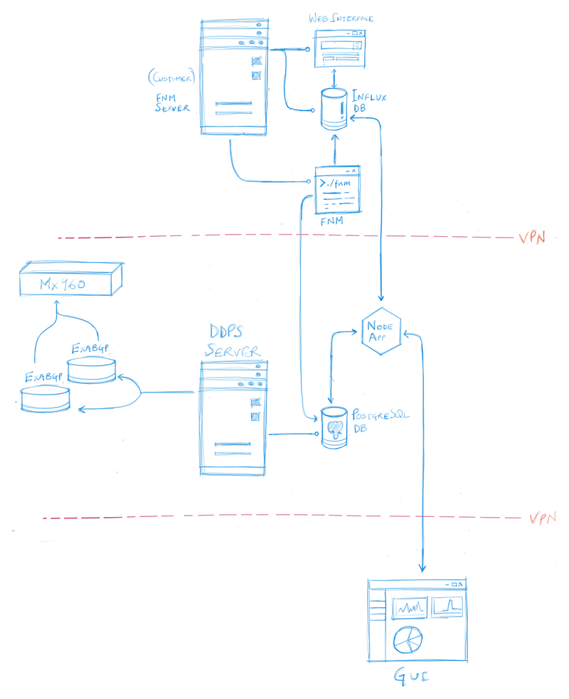

# README #

A single NodeJS application running on the **ddps** server accesses both the remote InfluxDB database linked with fastnetmon (for querying only) and the local PostgreSQL db (for querying and performing CRUD operations). We chose NodeJS as this would allow for a single language over - server and client - side applications to manage information flow. Hence allowing for easier debugging and future scaling up.

We have a single node application to manage several instance of fastnetmon and connected InfluxDB instances and the single PostgreSQL rules database for all rules over all fastnetmon instances categorized over networks and IPs. 

The following line diagram shows the specific architecture that we have now.

Also, we write queries in SQL that the node application parses and processes for both PostgreSQL and InfluxDB.  Thus the Node app provides the necessary apis and services that are used by the client application that serves as the GUI.

In essence a single app manages operations over *n-instances* of fastnetmon (and InfluxDB) and *1-instance* of the rules database implemented with PostgreSQL. The line diagram below shows the scaled version of the entire architecture.

| Function name | Description                    |
| ------------- | ------------------------------ |
| `help()`      | Display the __help__ window.   |
| `destroy()`   | **Destroy your computer!**     |

### What is this repository for? ###

* Quick summary
* Version
* [Learn Markdown](https://bitbucket.org/tutorials/markdowndemo)

### How do I get set up? ###

* Summary of set up
* Configuration
* Dependencies
* Database configuration
* How to run tests
* Deployment instructions

### Contribution guidelines ###

* Writing tests
* Code review
* Other guidelines

### Who do I talk to? ###

* Repo owner or admin
* Other community or team contact